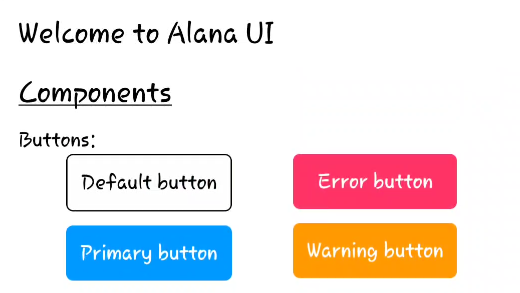
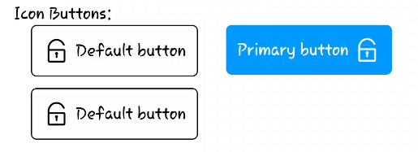
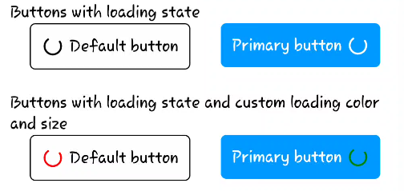
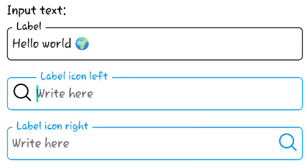
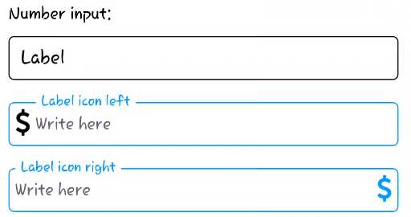
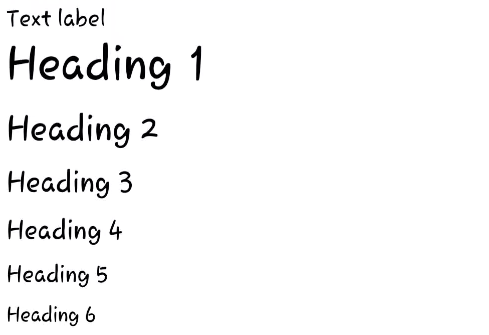
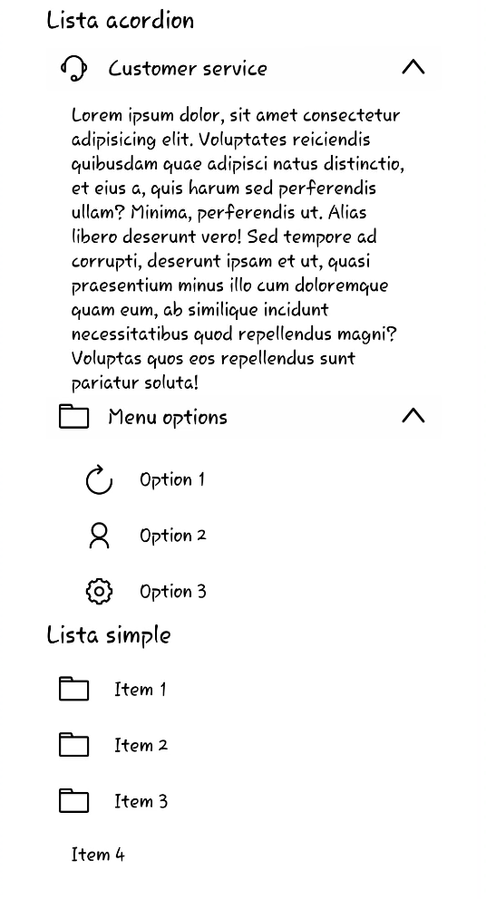

# Alana UI

Alana UI es una biblioteca de componentes de interfaz de usuario (UI) diseñada específicamente para React Native. Con Alana UI, puedes crear fácilmente interfaces elegantes y funcionales para tus aplicaciones móviles con React Native.

## Características principales

- Amplia gama de componentes predefinidos.
- Componentes personalizables para adaptarse a tus necesidades.
- Documentación completa y ejemplos de uso.
- Mantén la coherencia visual y la usabilidad en tus aplicaciones móviles.

## Instalación

Para instalar Alana UI en tu proyecto de React Native, simplemente ejecuta:

```
npm install alana-ui
```

o

```
yarn add alana-ui
```

## Uso

Para comenzar a utilizar Alana UI en tu proyecto, simplemente importa los componentes que necesitas y úsalos en tu aplicación:

```javascript
import { Button, TextInput } from 'alana-ui';

// Utiliza los componentes en tu aplicación
<Button title="Press me" onPress={() => console.log('Button pressed')} />
<TextInput placeholder="Enter your name" onChangeText={text => console.log(text)} />
```

Para obtener más información sobre cómo utilizar los diferentes componentes, consulta la [documentación](https://alana-ui-docs.com).

## Ejemplo de componentes















## Contribución

¡Nos encantaría recibir contribuciones! Si tienes alguna sugerencia, problema o quieres contribuir con código, no dudes en abrir un [issue](https://github.com/alana-ui/alana-ui/issues) o enviar un [pull request](https://github.com/alana-ui/alana-ui/pulls).

## Licencia

Alana UI está bajo la licencia [MIT](https://opensource.org/licenses/MIT).
