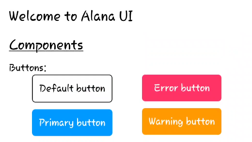
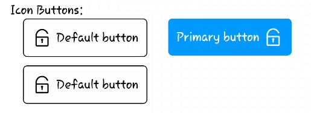
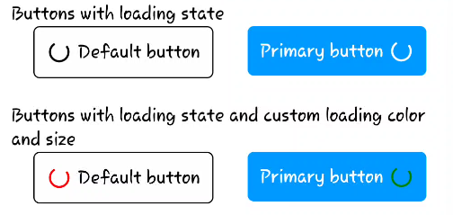
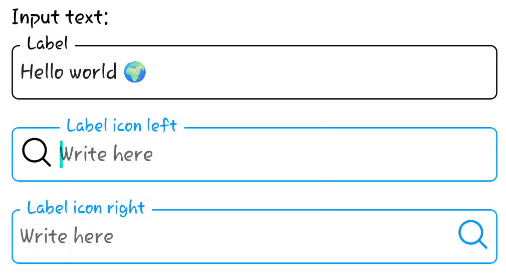
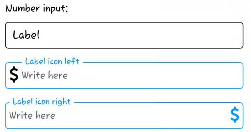
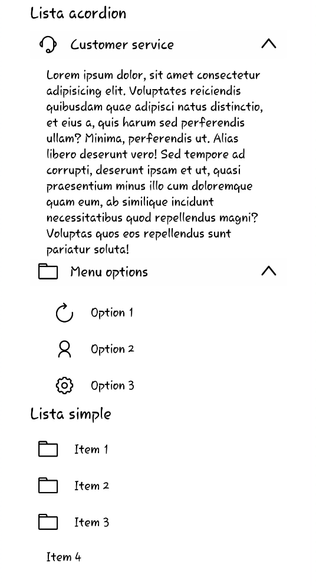

# Alana UI

Alana UI es una biblioteca de componentes de interfaz de usuario (UI) diseñada específicamente para React Native. Con Alana UI, puedes crear fácilmente interfaces elegantes y funcionales para tus aplicaciones móviles con React Native.

## Características principales

- Amplia gama de componentes predefinidos.
- Componentes personalizables para adaptarse a tus necesidades.
- Documentación completa y ejemplos de uso.
- Mantén la coherencia visual y la usabilidad en tus aplicaciones móviles.

## Instalación

Para instalar Alana UI en tu proyecto de React Native, simplemente ejecuta:

```
npm install alana-ui
```

o

```
yarn add alana-ui
```

## Uso

Para comenzar a utilizar Alana UI en tu proyecto, simplemente importa los componentes que necesitas y úsalos en tu aplicación:

```javascript
import { Button, TextInput } from 'alana-ui';

// Utiliza los componentes en tu aplicación
<Button title="Press me" onPress={() => console.log('Button pressed')} />
<TextInput placeholder="Enter your name" onChangeText={text => console.log(text)} />
```

Para obtener más información sobre cómo utilizar los diferentes componentes, consulta la [documentación](https://alana-ui-docs.com).

## Ejemplo de componentes















## Contribución

¡Nos encantaría recibir contribucones! Si tienes alguna sugerencia, problema o quieres contribuir con código, no dudes en abrir un [issue](https://github.com/alana-ui/alana-ui/issues) o enviar un [pull request](https://github.com/alana-ui/alana-ui/pulls).

<table>
  <tr>
    <td align="center">
      <a href="https://aj-derteano.github.io/">
        
        <br />
          <sub>
            <b>AJ Derteano</b>
          </sub>
      </a>
      <br />
      <a href="#ideas-AJ-Derteano" title="Ideas, Planning, & Feedback">🤔</a>
      <a href="https://github.com/AJ-Derteano/alana-ui/commits?author=AJ-Derteano" title="Code">💻</a>
      <a href="https://github.com/AJ-Derteano/alana-ui/commits?author=AJ-Derteano" title="Documentation">📖</a>
    </td>
  </tr>
</table>

## Licencia

Alana UI está bajo la licencia [MIT](https://opensource.org/licenses/MIT).
